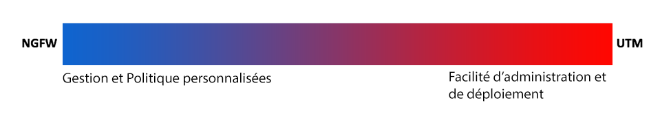
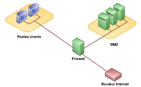

# Firewall

## Mots clés :

* DMZ : zone démilitarisée: 
* Pare-feu : 
* NGFW : next gen firewall, fw + detection d'intrusion
* SI : système d'information
* DSI : directeur des systèmes d'information
* Carte heuristique :
* Firewalling :
* Access list : liste perettant l'accès (ou non accès)
* Système de gestion unifiée :
* Sécurisation périmétrique : on bloque ce qui n'est pas autorisé
* Sécurité en profondeur : on prévoit que l énemi est entré
* ASA :
* UTM : unified thread managment
* Fortinet :
* Net filter :
* Appliance :
* IP table : fw
* Kerio :
* check point :
* Pfsense : fw
* IPCop : fw
* IPFire : fw

## Contexte :

** Quoi ?**

* Mettre en place un firewall
* Protéger le serveur de la DMZ
* Modifier l'architecture
* Gérer les accès

** Pourquoi ?**

* Sécuriser l'accès au SI
* Empêcher les attaques sur son site

** Comment ?**

* En mettant en place un système de gestion unifiée des menaces
* Aligner les politiques de sécurité avec la gouvernance de SI

## Contraintes :

* aligner les politiques de sécurité avec la gouvernance de SI
* coût faible
* Le serveur est dans une DMZ

## Problématique :

**Comment mettre en place une politique de sécurité à l'aide d'un pare-feu ?**

## Généralisation :

Sécurité

## Hypothèses :

* IPFire est basé sur Linux
* DMZ = demilitarized zone
* DMZ sécurise tout en les isolant
* On peut avoir un pare-feu applicatif t un sur le routeur
* Un pare-feu peut être logique ou physique
* L'IP table sert à créé des pare-feux et des ACLs
* Les ACLs permettent de filtrer le trafic
* Un pare-feu sert à filtre le trafic
* Le pare-feu est basé sur les ACLs
* On peut utiliser un prxy pour faire office de pare-feu
* Il existe des distributions linux permettant de monter des pare-feux gratuitement
* Une bonne pratique est d'interdire tout par défaut et autoriser ce qu'on veut laisser passer

## Plan d’action :

### Études

#### **ACLs**

Une ACL est une liste de règles permettant de filtrer ou d’autoriser du trafic sur un réseau en fonction de
certains critères (IP source, IP destination, port source, port destination, protocole

Elle peut servir à autoriser le trafic ou à le bloquer (whitelist/ blacklist)
On peut en appliquer une par interface et par sens au max

il existe 2 ype d'ACL les standard et les étendues : 
* les standards analysent le trafic en fonction de l'IP source, on les appliques le plus porche poosble de la destination
* les étendues qui analysent le trafic en foncton de l'IP source, ip destination, protocole, port source, port destination 

config :

acl numérique

	R1(config)#access-list [n°] permit [adress] [wildcard]
	R1(config)#access-list [n°] deny [adress] [wildcard] 
	R1(config)#access-list [n°] permit any

n°: 1-99 1300-1999 standard, 100-199 2000-2699	étendue

acl nommée

	R1(config)#ip access-list standard monACL
	R1(config-std-nacl)#permit [adresse] [wildcard]
verif

	R1#show access-lists

conf acl étendue:

	R1(config)#access-list 100 permit tcp any host 192.168.1.100 eq 80
	R1(config)#access-list 100 permit icmp 192.168.0.0 0.0.0.255 host 192.168.1.100
	

ajouter une règle

	R1(config-std-nacl)#15 permit 192.168.1.0 0.0.0.127
appliquer une acl à une interface : 

	R1(config-if)#ip access-group 1 in
OU
	
		R1(config-if)#ip access-group 1 out
	
#### **NGFW**

next generation firewall

firewalls avec détection d'intrusion et contrôle d'applications web 

(et au passage: Unified thread Managment  protection d'email, sécu point to point wifi, VPN et en général un NGFW)

ex: Sophos XG firewall

#### **Firewalls (fonctionnement)**

Sécurise le réseau local, détecte les tentatives d'intrusion et y pare au mieux possible. Permet aussi de restreindre l'accès interne vers l'extérieur (comme bloquer les jeux en ligne). 
Il existe différents types de filtrages:

1 . filtrage simple de paquet (Stateless)

méthode de filtrage la plus simple, elle opère au niveau de la couche réseau et transport.  Il accorde ou refuse le passage de paquets selon:

* l'ip source/destination
* le numéro de port source/destination
* le protocole de niveau 3 ou 4

Nécessite de configurer le Firewall ou le routeur avec des ACLs, le problème est donc que l'admin doit accorder beaucoup d'accès; Ex: pour autorisé les co depuis un réseau privé l'admin devra accepter toutes les connexions TPC provenant d'internet avec un port supérieur à 1024. Note : ne résiste pas au spoofing, flooding ou DoS

2 . filtrage de paquets avec état (statefull)

contrairement au stateless il conserve la trace des sessions et des connexions. Le firewall prends ses décisions en fonction des états de connexions. Protège de certains types de DoS

on n'a pas à garder le ports ouverts. pour ftp il faut gérer l' état de deux connexions, le firewall devra laisser passer le flux de données établi par le serveur et doit connaitre le protocole FTP et tous les protocoles fonctionnant sur le même principe  

3 . filtrage applicatif (pare-feu de type proxy ou proxying applicatif)

réalisé au niveau de la couche application : les requêtes sont traitées par des processus dédiés , ex une requête http traitée par un processus proxy http. Le firewall rejettera toutes les requêtes qui ne sont pas conformes aux spé du protocole, il doit donc connaître toutes les règles protocolaires des protocoles qu'il doit filtrer

Pb: très difficile de filtrer vu le nombre de protocole de couche 7 et devoir connaitre les règles de chaque protocole filtré pose problème pour les nouveaux protocoles et ceux maison. Même si il est plus sécurisé que le statefull il coûte beaucoup plus de perf

4. Que faire ?

protéger le proxy par un firewall Statefull Inspection et les séparer (évite de compromettre les 2 si un est compromis), cette méthode protège également contre l'ARP spoofing

Types de firewall :

**firewall bridge**
Relativement répandus fonctionnent comme des câbles mais avec la fonction de filtrage. Leurs interface n'ont pas d'IP et transfèrent simplement les paquets d d'une interface à une autre selon des règles. Puisqu'il n a pas d'IP il est indétectable (ne réponds pas à ARP non plus). On ne peut pas commettre d'attaque directe sur lui on ne peut donc le passer qu'en contournant ses règles de drop.

On les place généralement sur les switches. 
av:

* inévitable
* peu coûteux

inc:

* possible de contourner ses règles
* config contraignante
* fonctionnalités basiques

**firewall matériels**

Intégré directement au routeur, ils ont une intégration parfaite avec le matériel. La config est complexe et peu flexible mais peu vulnérable aux attaques. Son administration est plus aisée que les firewall bridge car ses spécificités sont définie par le constructeur, si on voulait en ajouter une on ne pourrait pas.

av:

* intégration matérielle 
* admin simple
* bien sécurisé

inc:

* on est dépendant du constructeur
* peu flexible

**firewall logiciel**

ils ont un inconvénient qui est qu'ils n'utilisent pas la couche bas réseau on pourrait donc passer outre le kernel pour récup les packets normalement drop mais on ne peut le faire qu'en s'étant introduit surr l’ordinateur pour y faire des modif (donc pour casser le firewall il faudrait déjà être dans le système...)

on peut les classer en plusieurs catégories:

les firewalls personnels:

souvent commerciaux, leur but est de sécu un ordinateur particulier et non un groupe d'ordinateur. payant, contraignant et peu sécurisé car devant être accessible à l'utilisateur final

av:

* sécurité en bout de chaine
* facile a personnaliser

inc:

* facile à contourner
* il y en a énormément difficile à départager

firewalls "sérieux" :

tournent généralement sur Linux (sécu et contrôle ++), ils ont pour but d'avoir le même comportement que les firewalls matériels mais ils sont configurables à la main. Le plus courant est **iptable** qui utilise le kernel linux.

av:

* personnalisable
* très sécurisé
inc:

* nécessite une admin système en plus

liste de firewalls:

libres :

* **Iptables**, linux 2.4 et + : rapide, ajout de règles
* Ipchains, linux 2.2
* Packet Filter (PF) d'openBSD
* IPFilter (IPF), BSD et Solaris 10 et 11
* IPfirewall (IPFW), freeBSD
* iSafer, windows

distrib linux:

* SmoothWall
* **IPCop** : monitoring+ FW, interface web
* Ipfire : fw, proxy, VP gateway, détection d'intrusion, wiki pour support
* Pfsense : très souple (config) 
* Zeroshell
* Amon
* Shorewall: interface web, supporte VPN, admin centralisée
* Uncomplicated Firewall (UFW): supporte ipv6, ajout de règles
* Vuurmuur : ipv6, NAT, real time monitoring, anti-spoofing
* Endian : bidirectionnel

Personnels:

* Comodo firewall
* Zone alarm
* Netbarrier
* Microsoft :
	* Pare-feu de connexion internet de Windows XP
	* Windows firewall
	* Microsoft Internet Security and Scceleration Server
* Jetico personnal firewall

Applicatifs:

* Microsoft Internet Security and Scceleration Server, pare-feu proxy cache de MS
* Modsecurity, module pour serveur web apache

Physiques:

[liste](https://en.wikipedia.org/wiki/List_of_router_and_firewall_distributions)

#### **DMZ**

Zone démilitarisée, zone de service. 
Il peut s'agir de services applicatifs (serveur web, serveur de messagerie) ou de services de sécurité (serveurs  mandataires - proxy - ou reverse proxy). Cette zone tient son nom de sa position classique dans l'architecture d'une passerelle

Sous réseau séparé du réseau local et isolé de celui-ci et d'internet par un firewall. Il contient les machines susceptibles d'être accédées depuis internet. LE firewall bloquera l'accès au réseau local et les services pouvant être accédés depuis internet seront dans la DMZ

Si le pare feu est compromis plus rien n'est sécurisé on peut donc en mettre en cascade afin d'éviter ce risque

**Attaques**

1: pas de firewall: tu l'as cherché
2: filtrer les flux entrants illégaux : la backdoor initie elle-même les sessions
3: bloquer les flux entrants et sortants : on peut utiliser un trojan qui exploite des applis qui se sont authentifiées
4: protection locale/firewall personnel : utiliser une appli autorisée, contourner le firewall avec une lib adaptée, kill le processus du firewall
5: piratage de VPN

#### **Différents périmètres de défense**

défense périmétrique : bloquer avec un pare feu et règles de routage les accès non autorisés

défense en profondeur : né chez les militaires, on se pare à 'éventualité que l'ennemi à franchi les défense. On va donc :

* isoler les pc inconnus dans un sous-réseau virtuel aux droits d'accès limité
* empêcher les utilisateurs de systèmes sensibles d'être admin de leurs ordis
* bloquer l'accès aux serveurs sensibles à des comptes privilégies ou aux connexions distants 
* utiliser des systèmes d’authentification robustes (ex : Kerberos) 

### Réalisations

#### **Définir les critères du firewall**

https://distrowatch.com/search.php

#### **Comparer les pare-feux**

cf dans pare-feu

#### **Configurer le pare-feu (packet-tracer)**

